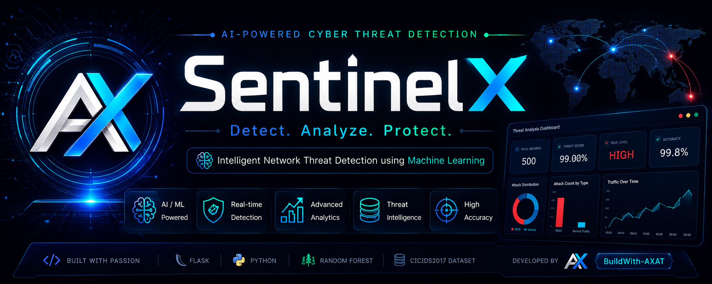
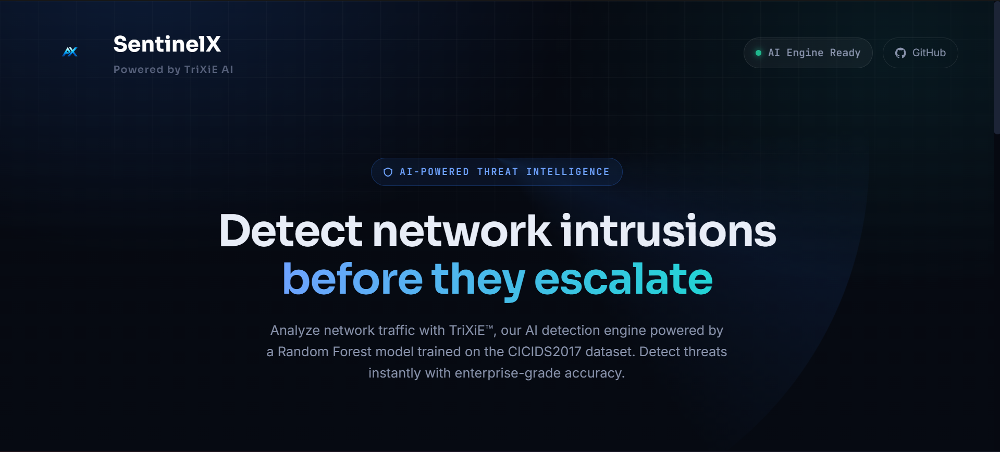
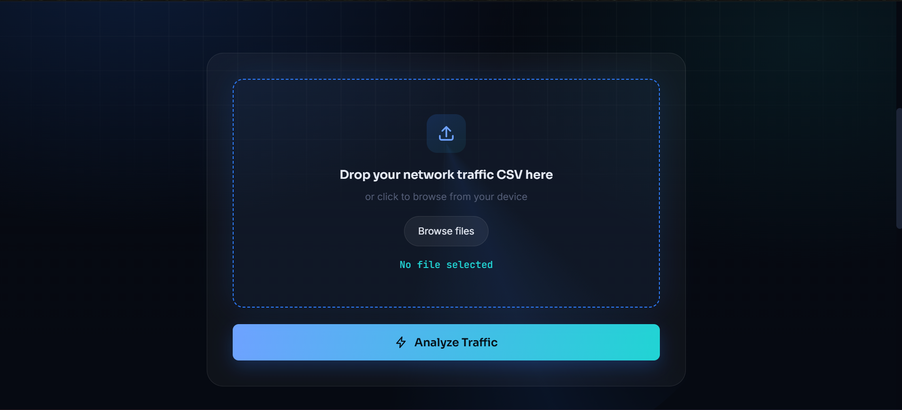
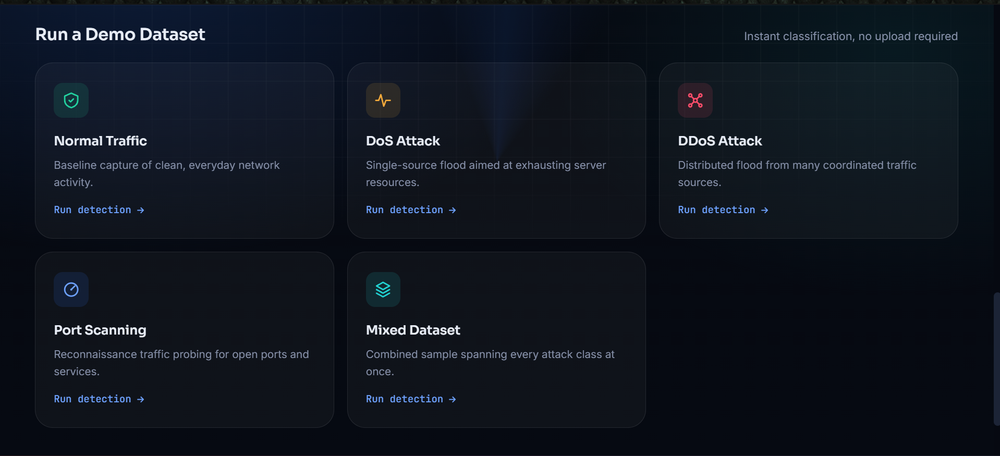
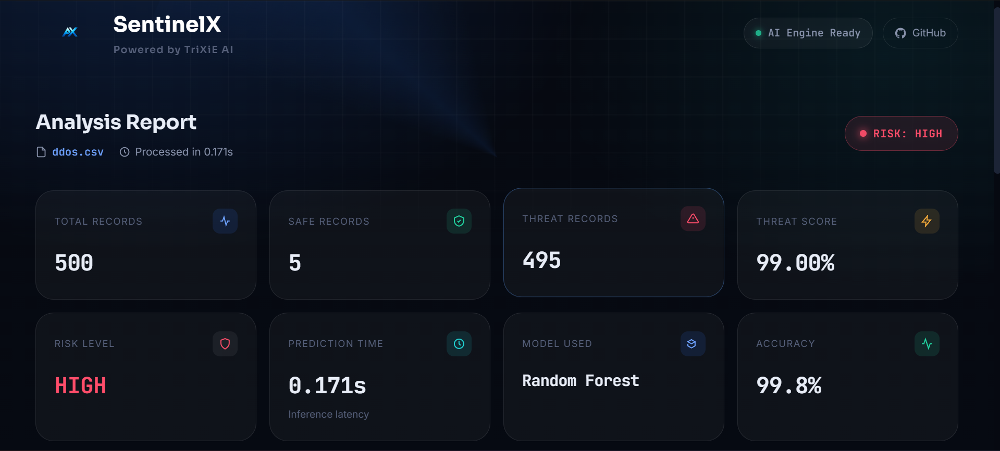
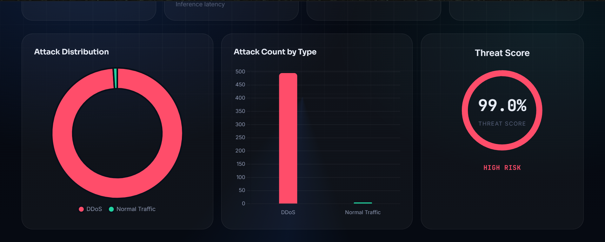
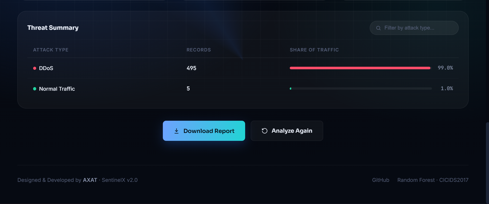

<div align="center">



#  SentinelX
### AI-Based Cyber Threat Detection Framework

Enterprise AI-powered Cyber Threat Detection Platform built using **Flask**, **Machine Learning**, and the **CICIDS2017 Dataset**.

<p>
<a href="https://sentinelx-4jit.onrender.com/"></a>
<a href="https://github.com/BuildWith-AXAT/AI-Based-Cyber-Threat-Detection-Framework"></a>
</p>

<p>


</p>

</div>

---

# 🌐 Live Website

**https://sentinelx-4jit.onrender.com/**

> **Note:** Hosted on Render free tier. First request may take 30–60 seconds.

---

# 📖 About

SentinelX is an AI-powered Cyber Threat Detection Framework that analyzes uploaded network traffic datasets and predicts malicious activity using a Random Forest model. The application provides an interactive dashboard, visual analytics, and downloadable reports through a clean Flask web interface.

---

# ✨ Features

- AI-powered Threat Detection
- Random Forest Classifier
- CSV Upload
- Interactive Dashboard
- Threat Distribution Charts
- Demo Dataset Support
- Downloadable Reports
- Responsive Dark UI

---

# 📸 Screenshots

## Home


## Upload


## Demo Dataset


## Dashboard


## Charts


## Summary


---

# 🤖 Machine Learning

- Algorithm: Random Forest Classifier
- Dataset: CICIDS2017
- Backend: Flask
- Language: Python
- Libraries: Scikit-learn, Pandas, NumPy, Plotly, Matplotlib

---

# 🛠️ Tech Stack

| Category | Technology |
|---|---|
| Backend | Flask |
| ML | Scikit-learn |
| Frontend | HTML, CSS, JavaScript |
| Data | Pandas, NumPy |
| Charts | Plotly, Matplotlib |
| Deployment | Render |

---

# 📂 Project Structure

```text
AI-Based-Cyber-Threat-Detection-Framework/
├── app.py
├── requirements.txt
├── model.pkl
├── templates/
├── static/
├── assets/
└── README.md
```

---

# 🚀 Installation

```bash
git clone https://github.com/BuildWith-AXAT/AI-Based-Cyber-Threat-Detection-Framework.git
cd AI-Based-Cyber-Threat-Detection-Framework
pip install -r requirements.txt
python app.py
```

---

# 💻 Usage

1. Launch the application.
2. Upload a CSV dataset.
3. Run prediction.
4. View analytics dashboard.
5. Download the report.

---

# 👨‍💻 Developer

**BuildWith-AXAT**

GitHub: https://github.com/BuildWith-AXAT

---

# 📄 License

This project is intended for educational and academic purposes.

---

<div align="center">

Made with ❤️ by **BuildWith-AXAT**

</div>
